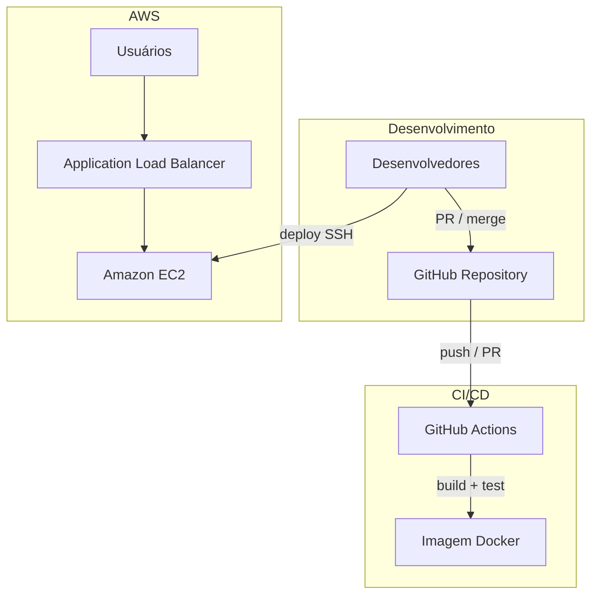

# Pipeline E-commerce · RotaExpress

Landing page institucional da **RotaExpress** com pipeline de entrega contínua, containerização e hospedagem em nuvem AWS.

[](https://github.com/PedroVazN/Pipeline-E-commerce/actions/workflows/ci-cd.yml)

**Repositório:** https://github.com/PedroVazN/Pipeline-E-commerce

---

## Sobre o projeto

A RotaExpress é uma operadora logística de fulfillment e última milha. Este repositório concentra a **one-page** de apresentação comercial e a **esteira DevOps** que valida a aplicação em cada alteração de código.

A infraestrutura combina Amazon EC2, imagem Docker reproduzível e GitHub Actions para integração contínua, com suporte a múltiplas instâncias e balanceamento de carga.

| Atributo | Descrição |
|----------|-----------|
| **Case** | 4 — Logística · E-commerce |
| **Stack** | HTML estático · Nginx · Docker · Amazon EC2 · GitHub Actions |
| **Página** | `index.html` — site responsivo RotaExpress |

---

## Equipe

| Integrante | GitHub | Papel |
|------------|--------|--------|
| Pedro Vaz | [@PedroVazN](https://github.com/PedroVazN) | Desenvolvimento e infraestrutura |
| Nathan Ferreira | [@NathanSec](https://github.com/NathanSec) | Revisão e aprovação de Pull Requests |

---

## Arquitetura



### Serviços

| Componente | Função |
|------------|------|
| **Amazon EC2** | Hospeda o container com a one-page |
| **Docker** | Empacota Nginx e a aplicação estática |
| **GitHub** | Controle de versão e revisão de código |
| **GitHub Actions** | Build e teste automatizados da imagem |

Cada instância pode expor um rótulo (`web-srv-01`, `web-srv-02`, …) no rodapé da página para identificação em ambientes com load balancer.

---

## Pipeline CI/CD

Workflow: [`.github/workflows/ci-cd.yml`](.github/workflows/ci-cd.yml)

| Estágio | Gatilho | Ação |
|---------|---------|------|
| **Build** | Push ou Pull Request em `main` | `docker build` da imagem |
| **Test** | Após build | Container efêmero + validação HTTP |

Revisões solicitadas para [@NathanSec](https://github.com/NathanSec) via [CODEOWNERS](.github/CODEOWNERS).

---

## Estrutura do repositório

```
.
├── index.html
├── Dockerfile
├── docker-entrypoint.sh
└── .github/
    ├── workflows/ci-cd.yml
    └── CODEOWNERS
```

---

## Execução local

```bash
docker build -t rotaexpress-onepage .
docker run -d -p 8080:80 -e INSTANCE_LABEL=web-srv-local rotaexpress-onepage
```

Aplicação em `http://localhost:8080`.

---

## Variáveis de ambiente

| Variável | Descrição | Padrão |
|----------|-----------|--------|
| `INSTANCE_LABEL` | Identificador no rodapé da página | `web-srv-01` |

Definir no build (`--build-arg`) ou em runtime (`-e`).

---

## Deploy na EC2

```bash
git clone https://github.com/PedroVazN/Pipeline-E-commerce.git
cd Pipeline-E-commerce
export INSTANCE_LABEL=web-srv-01
docker build --build-arg INSTANCE_LABEL=$INSTANCE_LABEL -t rotaexpress-onepage .
docker run -d --name rotaexpress -p 80:80 -e INSTANCE_LABEL=$INSTANCE_LABEL rotaexpress-onepage
```
