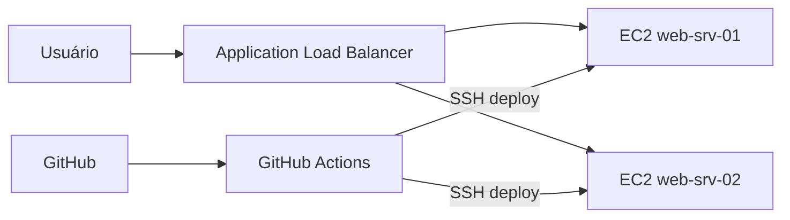

# RotaExpress — Case 4 (Logística · E-commerce)

Projeto acadêmico **Publicando a One-Page na AWS** — dupla responsável por hospedar a landing page com alta disponibilidade, repositório Git, pipeline CI/CD (GitHub Actions) e container Docker.

| Item | Valor |
|------|--------|
| **Case** | 4 — Logística · E-commerce |
| **Empresa** | RotaExpress |
| **Foco** | Escala, integração de sistemas, KPIs, picos (Black Friday) |
| **Repositório** | https://github.com/PedroVazN/Projeto-Pipeline-E-commerce |

---

## O que o professor pede (resumo)

| Fase | Objetivo | Peso | Evidência (print) |
|------|----------|------|-------------------|
| **1** | EC2 + página no ar | 20% | Site no navegador com **IP público** e rótulo `web-srv-XX` no rodapé |
| **2** | GitHub | 20% | Tela do repositório + **link** |
| **3** | GitHub Actions (CI/CD) | 40% | Pipeline + **histórico de execução** |
| **4** | Dockerfile (IaaS) | 20% | Dockerfile + uso no pipeline |

**Entrega final:** PDF com evidências + **vídeo** explicando arquitetura, CI/CD e demonstração.

---

## Arquitetura sugerida (Case 4 — escala)



No `index.html`, altere `INSTANCE_LABEL` em **cada** instância para ver qual servidor atendeu (comentário no arquivo, linha ~159).

---

## Passo a passo

### Pré-requisitos

- Conta AWS (Free Tier)
- Conta GitHub
- Par de chaves SSH (.pem) para EC2
- [Docker Desktop](https://www.docker.com/products/docker-desktop/) (opcional, para testar local)

---

### Fase 1 — EC2 e página no ar (20%)

1. **Console AWS** → EC2 → **Launch instance**
   - Nome: `rotaexpress-web-01`
   - AMI: Amazon Linux 2023
   - Tipo: `t2.micro` ou `t3.micro`
   - Key pair: crie/baixe `.pem`
   - Security group: liberar **22** (SSH) e **80** (HTTP) do seu IP (ou 0.0.0.0/0 só para teste acadêmico)

2. Conecte por SSH (PowerShell):

```powershell
ssh -i "C:\caminho\sua-chave.pem" ec2-user@SEU_IP_PUBLICO
```

3. Na EC2, instale Docker:

```bash
sudo dnf update -y
sudo dnf install -y docker git
sudo systemctl enable --now docker
sudo usermod -aG docker ec2-user
# saia e entre de novo no SSH para o grupo docker valer
```

4. Envie o projeto ou clone o GitHub:

```bash
git clone https://github.com/PedroVazN/Projeto-Pipeline-E-commerce.git
cd Projeto-Pipeline-E-commerce
export INSTANCE_LABEL=web-srv-01
docker build --build-arg INSTANCE_LABEL=$INSTANCE_LABEL -t rotaexpress-onepage .
docker run -d --name rotaexpress -p 80:80 -e INSTANCE_LABEL=$INSTANCE_LABEL rotaexpress-onepage
```

5. Abra no navegador: `http://SEU_IP_PUBLICO`  
   - Confirme o rodapé: **Servido por `web-srv-01`**
   - **Print:** barra de endereço com IP + rodapé com o rótulo

6. *(Opcional, recomendado para Case 4)* Segunda instância `web-srv-02` + **ALB** para demonstrar balanceamento.

---

### Fase 2 — GitHub (20%)

1. Repositório já criado: https://github.com/PedroVazN/Projeto-Pipeline-E-commerce  
2. No seu PC (pasta do projeto):

```powershell
cd C:\Users\25170632\Documents\case4_rotaexpress
git remote add origin https://github.com/PedroVazN/Projeto-Pipeline-E-commerce.git
git push -u origin main
```

3. **Print:** página do repo no GitHub (código, README, último commit).

---

### Fase 3 — GitHub Actions / CI/CD (40%)

1. No GitHub: **Settings** → **Secrets and variables** → **Actions** → New repository secret:

| Secret | Exemplo |
|--------|---------|
| `EC2_HOST` | IP público da EC2 |
| `EC2_USER` | `ec2-user` |
| `EC2_SSH_KEY` | conteúdo completo do arquivo `.pem` |

2. Na EC2, clone o repo em `~/rotaexpress` (mesmo caminho do workflow).

3. Faça um commit qualquer em `main` → aba **Actions** → workflow **CI/CD RotaExpress**.

4. **Prints:** workflow em execução + tela de **run** concluído (verde) com jobs `Build` e `Deploy`.

> Sem os secrets, o job **Build** ainda roda (vale evidência parcial); o **Deploy** falha até configurar SSH.

---

### Fase 4 — Dockerfile no pipeline (20%)

- Arquivo: [`Dockerfile`](Dockerfile) — imagem Nginx + one-page  
- Entrypoint: [`docker-entrypoint.sh`](docker-entrypoint.sh) — injeta `INSTANCE_LABEL`  
- Pipeline: [`.github/workflows/ci-cd.yml`](.github/workflows/ci-cd.yml) — `docker build` + teste `curl` + deploy

**Prints:** Dockerfile no repo + step “Build da imagem” no Actions.

**Teste local:**

```powershell
docker build -t rotaexpress-onepage .
docker run -d -p 8080:80 -e INSTANCE_LABEL=web-srv-local rotaexpress-onepage
# http://localhost:8080
```

---

## Checklist de entrega

- [ ] PDF: nomes, RAs, Case 4, prints das 4 fases
- [ ] Vídeo: arquitetura, EC2, repo, pipeline, Docker, demo no navegador
- [ ] Link do repositório no relatório

---

## Pilares AWS (para o vídeo/relatório)

| Pilar | Como aparece no projeto |
|-------|-------------------------|
| **Excelência operacional** | CI/CD automatizado, deploy repetível |
| **Segurança** | Security Group, SSH com chave, secrets no GitHub |
| **Confiabilidade** | ALB + múltiplas EC2 (opcional), health check |
| **Eficiência de performance** | Container leve (Nginx Alpine) |
| **Otimização de custos** | t2.micro, escala sob demanda (ASG opcional) |

---

## Integrantes (preencher no PDF)

1. Nome _________________ RA _________  
2. Nome _________________ RA _________
