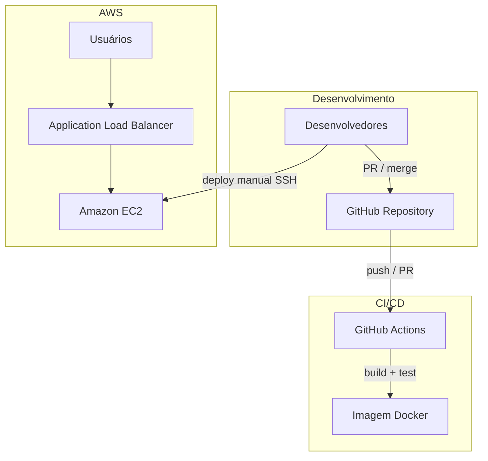

# Pipeline E-commerce · RotaExpress

Landing page institucional da **RotaExpress** com pipeline de entrega contínua, containerização e hospedagem em nuvem AWS. Projeto acadêmico — **Case 4** (Logística · E-commerce · Indústria 4.0).

[](https://github.com/PedroVazN/Pipeline-E-commerce/actions/workflows/ci-cd.yml)

**Repositório:** https://github.com/PedroVazN/Pipeline-E-commerce

---

## Sobre o projeto

A RotaExpress é uma operadora logística de fulfillment e última milha. Este repositório concentra a **one-page** de apresentação comercial e a **esteira DevOps** que publica, valida e implanta a aplicação de forma automatizada.

O cenário do case exige disponibilidade em picos de tráfego (campanhas, Black Friday) e uso eficiente de recursos em períodos de baixa demanda — resolvido com infraestrutura elástica na AWS, imagem Docker reproduzível e GitHub Actions como orquestrador de CI/CD.

| Atributo | Descrição |
|----------|-----------|
| **Case** | 4 — Logística · E-commerce |
| **Setor** | Fulfillment, marketplaces, última milha |
| **Stack** | HTML estático · Nginx · Docker · Amazon EC2 · GitHub Actions |
| **Página** | `index.html` — site responsivo RotaExpress |

---

## Equipe

| Integrante | GitHub | Papel |
|------------|--------|--------|
| Pedro Vaz | [@PedroVazN](https://github.com/PedroVazN) | Desenvolvimento e infraestrutura |
| Nathan Ferreira | [@NathanSec](https://github.com/NathanSec) | Revisão e aprovação de Pull Requests |

---

## Arquitetura



### Serviços e responsabilidades

| Componente | Função |
|------------|--------|
| **Amazon EC2** | Hospeda o container com a one-page (IaaS) |
| **Docker** | Empacota Nginx + aplicação estática de forma portável |
| **GitHub** | Controle de versão, revisão em dupla e rastreabilidade |
| **GitHub Actions** | Integração contínua — build e teste da imagem Docker |

Cada instância expõe um **rótulo de servidor** (`web-srv-01`, `web-srv-02`, …) no rodapé da página, permitindo validar balanceamento e múltiplos nós atrás de um load balancer.

---

## Pipeline CI/CD

Workflow: [`.github/workflows/ci-cd.yml`](.github/workflows/ci-cd.yml)

| Estágio | Gatilho | Ação |
|---------|---------|------|
| **CI — Build** | Push ou Pull Request em `main` | `docker build` da imagem de produção |
| **CI — Test** | Após build | Sobe container efêmero e valida HTTP 200 + conteúdo |

A publicação na EC2 é feita **manualmente via SSH** (ver [GUIA-IMPLEMENTACAO.md](GUIA-IMPLEMENTACAO.md)).

Revisões de código são solicitadas automaticamente para [@NathanSec](https://github.com/NathanSec) via [CODEOWNERS](.github/CODEOWNERS).

---

## Estrutura do repositório

```
.
├── index.html                 # One-page RotaExpress
├── Dockerfile                 # Imagem Nginx + site
├── docker-entrypoint.sh       # Injeta INSTANCE_LABEL no deploy
├── .github/
│   ├── workflows/ci-cd.yml    # Pipeline CI/CD
│   └── CODEOWNERS             # Revisor padrão
└── scripts/                   # Utilitários locais
```

---

## Execução local

Requisitos: [Docker](https://www.docker.com/products/docker-desktop/)

```bash
docker build -t rotaexpress-onepage .
docker run -d -p 8080:80 -e INSTANCE_LABEL=web-srv-local rotaexpress-onepage
```

Aplicação disponível em `http://localhost:8080`.

---

## Variáveis de ambiente

| Variável | Descrição | Padrão |
|----------|-----------|--------|
| `INSTANCE_LABEL` | Identificador exibido no rodapé da página | `web-srv-01` |

Configurável no build (`--build-arg`) ou em runtime (`-e`) no Docker e na EC2.

---

## Documentação operacional

Instruções detalhadas de implementação (AWS, GitHub, evidências do trabalho e entrega): **[GUIA-IMPLEMENTACAO.md](GUIA-IMPLEMENTACAO.md)**

---

## Licença e contexto acadêmico

Projeto desenvolvido para a disciplina de publicação em nuvem (DevOps / AWS). Uso restrito ao contexto educacional da dupla.
